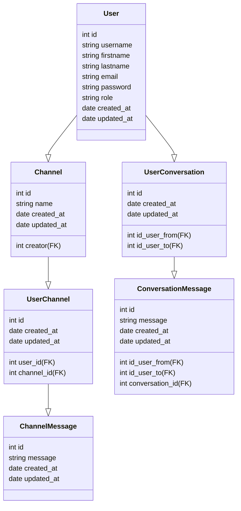

# Entitées

```mermaid
classDiagram
  User --|> Channel
  Channel --|> UserChannel
  UserChannel --|> ChannelMessage
  User --|> UserConversation
  UserConversation --|> ConversationMessage
  
  class User{
    int id
    string username
    string firstname
    string lastname
    string email
    string password
    string role
    date created_at
    date updated_at
  }
  
  class Channel{
    int id
    string name
    int creator (FK)
    date created_at
    date updated_at
  }
  
  class UserChannel{
    int id
    int user_id (FK)
    int channel_id (FK)
    date created_at
    date updated_at
  }
  
  class ChannelMessage{
    int id
    string message
    date created_at
    date updated_at
  }
  
  class UserConversation{
    int id
    int id_user_from (FK)
    int id_user_to (FK)
    date created_at
    date updated_at
  }
  
  class ConversationMessage{
    int id
    string message
    int id_user_from (FK)
    int id_user_to (FK)
    int conversation_id (FK)
    date created_at
    date updated_at
  }
```
