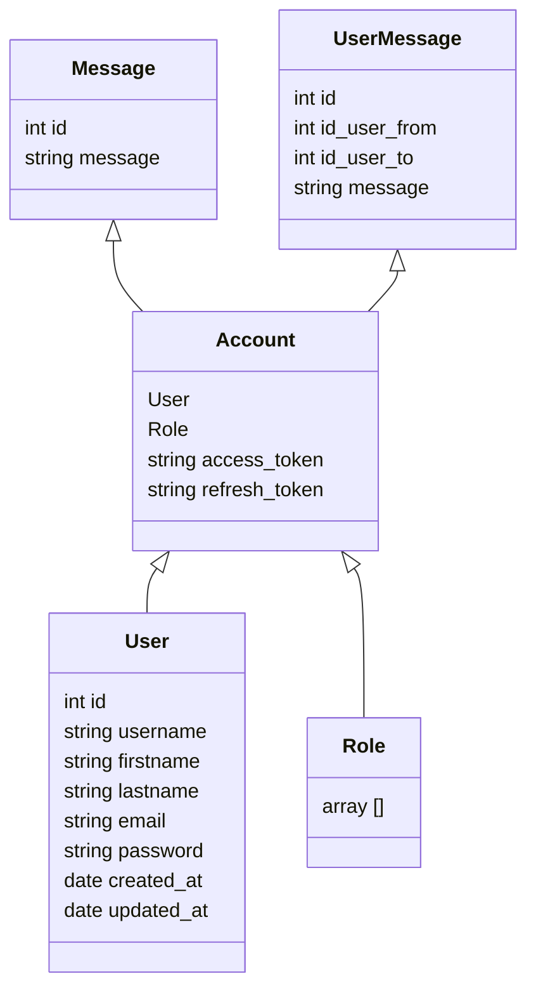

# Entitées

```mermaid
classDiagram
  Account <|-- User
  Account <|-- Role
  Message <|-- Account
  UserMessage <|-- Account
   
  class User{
    int id
    string username
    string firstname
    string lastname
    string email
    string password
    date created_at
    date updated_at
  }

  class Role{
    array []
  }

  class Account{
    User
    Role
    string access_token
    string refresh_token
  }

  class Message{
    int id
    string message
  }

  class UserMessage{
    int id
    int id_user_from
    int id_user_to
    string message
  }
```
