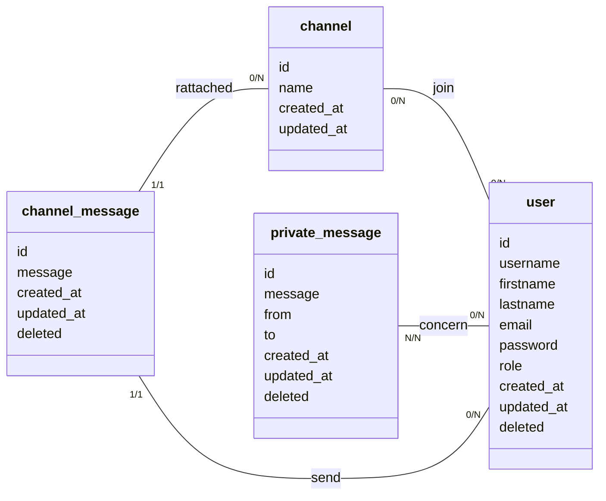

# Modèle Conceptuel de Données

```mermaid
classDiagram
  direction LR
  channel "0/N" -- "0/N" user : join
  private_message "N/N" -- "0/N" user : concern
  channel_message "1/1" -- "0/N" user : send
  channel_message "1/1" -- "0/N" channel : rattached
   
  class user{
    id
    username
    firstname
    lastname
    email
    password
    role
    created_at
    updated_at
    deleted
  }

  class channel {
    id
    name
    created_at
    updated_at
  }

  class channel_message{
    id
    message
    created_at
    updated_at
    deleted
  }

  class private_message{
    id
    message
    from
    to
    created_at
    updated_at
    deleted
  }
```
