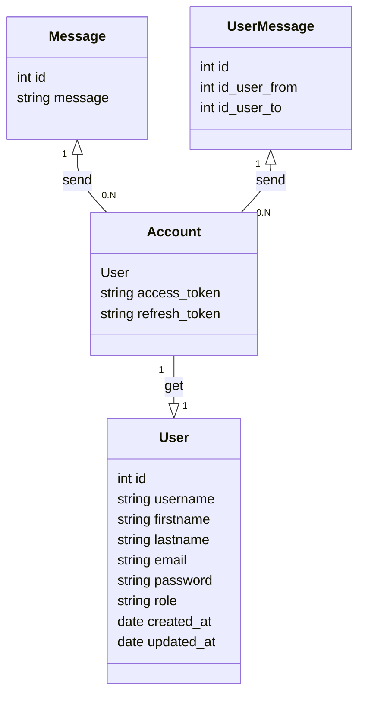

# Model Conceptuel de Données

```mermaid
classDiagram
  Account "1" --|> "1" User : get
  Message "1" <|-- "0.N" Account : send
  UserMessage "1" <|-- "0.N" Account : send
   
  class User{
    int id
    string username
    string firstname
    string lastname
    string email
    string password
    string role
    date created_at
    date updated_at
  }

  class Account{
    User
    string access_token
    string refresh_token
  }

  class Message{
    int id
    string message
  }

  class UserMessage{
    int id
    int id_user_from
    int id_user_to
  }
```