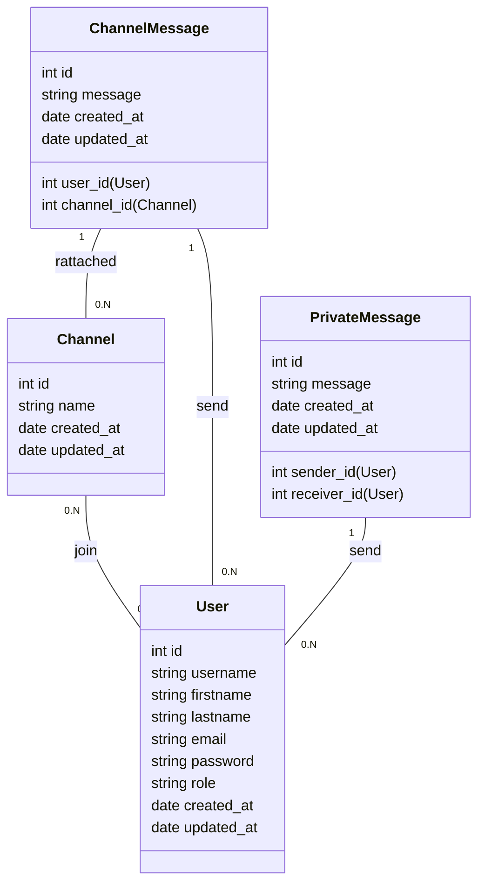

# Modèle Conceptuel de Données

```mermaid
classDiagram
  Channel "0.N" -- "0.N" User : join
  ChannelMessage "1" -- "0.N" User : send
  ChannelMessage "1" -- "0.N" Channel : rattached
  PrivateMessage "1" -- "0.N" User : send
   
  class User{
    int id
    string username
    string firstname
    string lastname
    string email
    string password
    string role
    date created_at
    date updated_at
  }

  class Channel {
    int id
    string name
    date created_at
    date updated_at
  }

  class ChannelMessage{
    int id
    string message
    int user_id (User)
    int channel_id (Channel)
    date created_at
    date updated_at
  }

  class PrivateMessage{
    int id
    string message
    int sender_id (User)
    int receiver_id (User)
    date created_at
    date updated_at
  }
```
